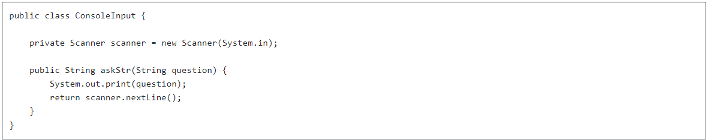

1. Создайте репозиторий job4j_di, подключите checkstyle, добавьте .gitignore, заполните README.md. Все задания из раздела "DI. Внедрение зависимостей" выполняйте в этом репозитории.

2. Добавьте в класс StartUI зависимость от класса ConsoleInput. В качестве реализации этого класса можете использовать следующий код:

    
3. С помощью Context проинициализируйте StartUI.

4. Загрузите код в репозиторий. Оставьте ссылку на коммит.

5. Переведите ответственного на Петра Арсентьева.